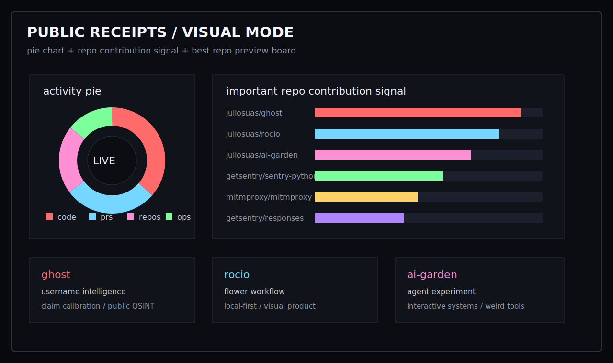

<p align="center">
  
</p>

```text
> boot github/profile --handle=juliosuas
> load single_terminal_bio --asuka --akari --madoka
> mount github tech_stack projects upstream_prs repo_screenshots
> render profile_readme --public --no-secrets --receipts-only
```

<p align="center">
  
</p>

<p align="center">
  
  
  
  
</p>

<!-- STATUS-GAME:START -->
```text
PUBLIC RUN STATE
FOLLOWERS        95
PUBLIC REPOS     63
MERGED PRS       45
OPEN PRS         14
YEAR SIGNAL      1221 contributions
LAST 7 DAYS      150 contributions
UPDATED          2026-06-06 07:58 UTC
```
<!-- STATUS-GAME:END -->

<sub>
Audit trail: [`type:pr author:juliosuas is:merged is:public`](https://github.com/search?q=type%3Apr+author%3Ajuliosuas+is%3Amerged+is%3Apublic&type=pullrequests)
</sub>

## `stats / graphic mode`

<p align="center">
  
</p>

<p align="center">
  
  
</p>

<p align="center">
  
</p>

## `important repo signal`

- `ghost` - username intelligence and platform claim calibration. [Repo](https://github.com/juliosuas/ghost)
- `rocio` - visual flower workflow, local-first product surface. [Repo](https://github.com/juliosuas/rocio)
- `ai-garden` - agent-driven interactive experiment. [Repo](https://github.com/juliosuas/ai-garden)
- `sentry-python` - upstream privacy/scrubbing contribution. [PR #6241](https://github.com/getsentry/sentry-python/pull/6241)
- `responses` - upstream playback/header fix. [PR #791](https://github.com/getsentry/responses/pull/791)
- `mitmproxy` - upstream binary tail detection fix. [PR #8196](https://github.com/mitmproxy/mitmproxy/pull/8196)

## `best repos / screenshots`

<p align="center">
  <a href="https://github.com/juliosuas/ghost">
    
  </a>
  <a href="https://github.com/juliosuas/rocio">
    
  </a>
  <a href="https://github.com/juliosuas/ai-garden">
    
  </a>
</p>

<p align="center">
  <a href="https://github.com/juliosuas/gstack">
    
  </a>
  <a href="https://github.com/juliosuas/copyfail-guard">
    
  </a>
  <a href="https://github.com/juliosuas/jeffrey-os-dashboard">
    
  </a>
</p>

## `merge receipts`

- `ghost` - [#9 Calibrate username platform claims](https://github.com/juliosuas/ghost/pull/9)
- `ghost` - [#8 Refresh CI lint coverage](https://github.com/juliosuas/ghost/pull/8)
- `sentry-python` - [#6241 Add option to drop scrubbed user IP addresses](https://github.com/getsentry/sentry-python/pull/6241)
- `responses` - [#791 Remove content-type from headers in file playback](https://github.com/getsentry/responses/pull/791)
- `mitmproxy` - [#8196 Avoid IndexError in binary tail detection](https://github.com/mitmproxy/mitmproxy/pull/8196)
- `maigret` - [#2588 Disable broken RomanticCollection check](https://github.com/soxoj/maigret/pull/2588)
- `jc` - [#692 Fix hex prefix handling in ifconfig parser](https://github.com/kellyjonbrazil/jc/pull/692)

<details>
<summary><code>open /g/ transmission</code></summary>

```text
This is not a portfolio template.
It is a public terminal surface.

The waifu ASCII is aesthetic.
The stats are live.
The repo screenshots are links.
The claims are tied to public receipts.
```

</details>

```text
> logout
session saved: public_profile/terminal_waifu_receipts
```
