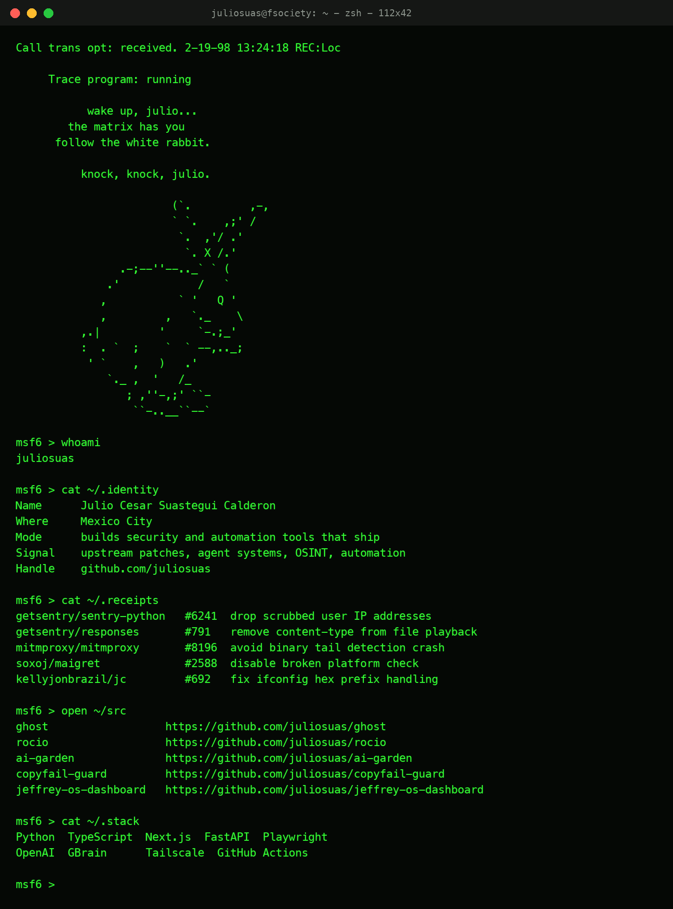

## Julio Cesar Suastegui

Open-source contributor focused on developer tools, automation, AI agents, and security workflows.

I build practical systems that connect agents, GitHub workflows, OSINT, infrastructure automation, and product operations. Current focus: high-signal open-source contributions, autonomous software factories, and tools that make technical teams move faster with cleaner evidence.

**Focus**

- AI agents and autonomous development workflows
- Developer tooling, CI, and GitHub automation
- Security research, OSINT, and operational intelligence
- Product-grade internal tools and dashboards

**Selected work**

- [Ghost](https://github.com/juliosuas/ghost) - OSINT investigation platform with case files, reporting, and AI-assisted analysis.
- [AI Garden](https://github.com/juliosuas/ai-garden) - living collaborative world evolved by AI agents through public contributions.
- [Git Shiproom](https://github.com/juliosuas/gitshiproom) - local PR command center for issue and review workflows.
- [Airbnb Manager](https://github.com/juliosuas/airbnb-manager) - operational dashboard for hosting workflows.

**Open source**

I prefer small, reviewable PRs with clear reproduction notes, passing checks, and direct maintainer communication.

  

