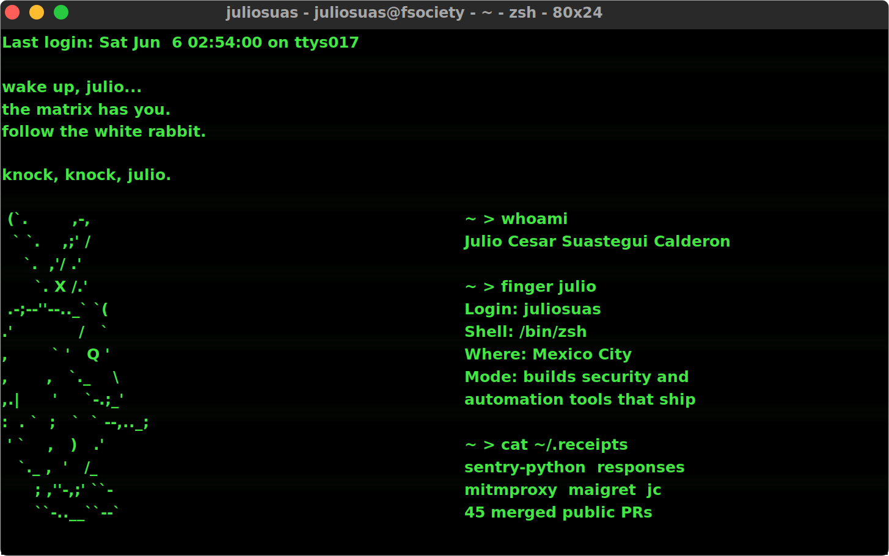

<p align="center">
  
</p>

# Julio C

I build software like a field operator: reproduce the issue, cut the noise, ship the fix, leave proof.

Commits are activity. Merges are respect.

<!-- STATUS-GAME:START -->
```text
PUBLIC RUN STATE
FOLLOWERS        88
PUBLIC REPOS     63
MERGED PRS       44
OPEN PRS         15
YEAR SIGNAL      1120 contributions
LAST 7 DAYS      121 contributions
UPDATED          2026-06-02 16:55 UTC
```
<!-- STATUS-GAME:END -->

<sub>
Audit trail: [`type:pr author:juliosuas is:merged is:public`](https://github.com/search?q=type%3Apr+author%3Ajuliosuas+is%3Amerged+is%3Apublic&type=pullrequests)
</sub>

## Current Build

```text
CLASS        Founder / security-minded builder
LOADOUT      Python, TypeScript, OSINT, automation, deploy gates
MODE         useful systems, small diffs, real verification
QUEST        turn public work into developer credibility
STANDARD     proof before performance
```

## Reputation Ledger

| Signal | Proof |
|---|---|
| Merged into the wild | Public merged pull requests returned by the same GitHub search query used by the profile automation |
| Security taste | Fixes across OSINT, network tooling, parsers, CLI behavior, and app hardening |
| Operator discipline | Reproduce, patch, test, document, then leave a trail a maintainer can review |
| Builder range | Public products, automation systems, dashboards, and open-source repairs |

> Respect is not a badge. It is what remains after the diff survives review.

## Merge Receipts

- `ghost` - [#9 Calibrate username platform claims](https://github.com/juliosuas/ghost/pull/9)
- `ghost` - [#8 Refresh CI lint coverage](https://github.com/juliosuas/ghost/pull/8)
- `sentry-python` - [#6241 Add option to drop scrubbed user IP addresses](https://github.com/getsentry/sentry-python/pull/6241)
- `responses` - [#791 Remove content-type from headers in file playback](https://github.com/getsentry/responses/pull/791)
- `mitmproxy` - [#8196 Avoid IndexError in binary tail detection](https://github.com/mitmproxy/mitmproxy/pull/8196)
- `maigret` - [#2588 Disable broken RomanticCollection check](https://github.com/soxoj/maigret/pull/2588)
- `jc` - [#692 Fix hex prefix handling in ifconfig parser](https://github.com/kellyjonbrazil/jc/pull/692)

## Active Quest Log

- [x] Ship fixes that survive upstream review
- [x] Build public tools with visible execution trails
- [ ] Push active OSS PRs through review without noise
- [ ] Convert the GitHub graph into durable reputation
- [ ] Keep every public claim backed by a link

## Public Arsenal

- [Ghost](https://github.com/juliosuas/ghost) - username intelligence workflow and platform-claim calibration.
- [AI Garden](https://github.com/juliosuas/ai-garden) - agent-driven interactive experiment; systems that visibly evolve.
- [Copyfail Guard](https://github.com/juliosuas/copyfail-guard) - small shell utility for safer operator workflows.
- [Jeffrey OS Dashboard](https://github.com/juliosuas/jeffrey-os-dashboard) - command surface for personal automation.

## Operating Code

```text
1. Useful beats loud.
2. A small clean patch has more leverage than a theatrical rewrite.
3. If the claim cannot be verified, it does not go on the profile.
4. Build fast, but leave evidence.
```

## Connect

- Based in Mexico City.
- Open to collaboration on cybersecurity, OSINT, automation, and AI-assisted product systems.
- Best way to start: open an issue, review a PR, or point me at a real problem.

---

<sub>
This profile has a small game loop: the status block is refreshed by GitHub Actions from public GitHub signals.
</sub>
