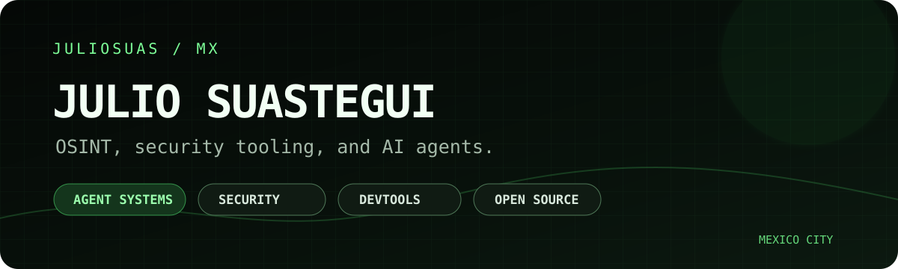
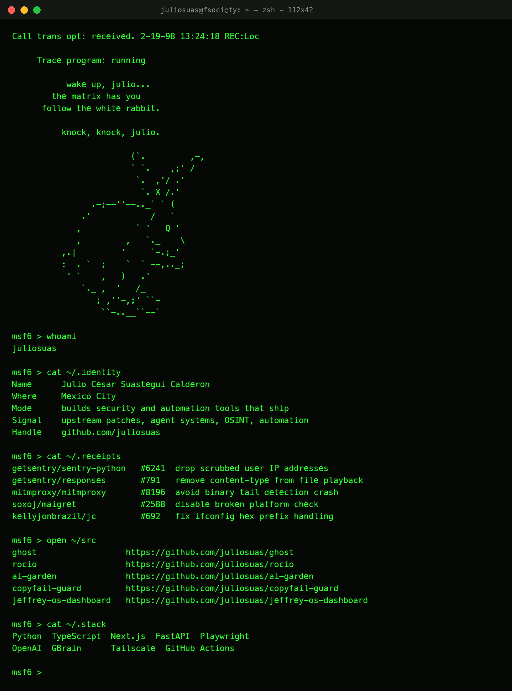
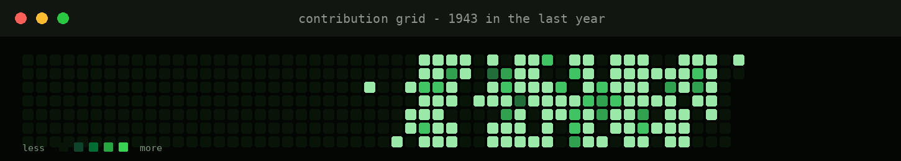

  

  
  
  

I build **agentic engineering systems, security tooling, and product operations** that turn ambiguous work into tested, reviewable software. My current obsession is making autonomous development accountable: narrow diffs, reproducible evidence, hard QA gates, and useful products at the end.

Based in Mexico City. Working in public across AI agents, developer tooling, OSINT, cybersecurity, and automation.

### Merged upstream · selected impact

  
  

Recognizable organizations accepted this work into the software people use. The headline explains the value; the receipt exposes the exact code review.

<table>
  <tr>
    <td width="72" align="center">
      
    </td>
    <td>
      <strong>Sentry · Python SDK</strong> 
      <a href="https://github.com/getsentry/sentry-python/pull/6241"><code>#6241 MERGED</code></a> — gave teams a privacy control that drops scrubbed user IP addresses from the official SDK. 
      Python · privacy · SDK behavior
    </td>
  </tr>
  <tr>
    <td width="72" align="center">
      
    </td>
    <td>
      <strong>Palantir · Blueprint</strong> 
      <a href="https://github.com/palantir/blueprint/pull/8165"><code>#8165 MERGED</code></a> — made large React migrations safer by detecting deprecated components hidden behind aliases. 
      TypeScript · React · static analysis
    </td>
  </tr>
  <tr>
    <td width="72" align="center">
      
    </td>
    <td>
      <strong>OWASP · Agent Security Regression Harness</strong> 
      <a href="https://github.com/OWASP/Agent-Security-Regression-Harness/pull/149"><code>#149 MERGED</code></a> — enabled more realistic, authenticated HTTP testing for AI-agent security regressions. 
      Python · agent security · HTTP testing
    </td>
  </tr>
  <tr>
    <td width="72" align="center">
      
    </td>
    <td>
      <strong>Aqua Security · Trivy</strong> 
      <a href="https://github.com/aquasecurity/trivy/pull/10828"><code>#10828 MERGED</code></a> · <a href="https://github.com/aquasecurity/trivy/pull/10857"><code>#10857 MERGED</code></a> — made a widely used software-supply-chain scanner easier to operate correctly. 
      Go ecosystem · security · developer experience
    </td>
  </tr>
  <tr>
    <td width="72" align="center">
      
    </td>
    <td>
      <strong>Maigret · repeat contributor</strong> 
      <a href="https://github.com/soxoj/maigret/pull/2318"><code>#2318</code></a> · <a href="https://github.com/soxoj/maigret/pull/2442"><code>#2442</code></a> · <a href="https://github.com/soxoj/maigret/pull/2558"><code>#2558</code></a> · <a href="https://github.com/soxoj/maigret/pull/2588"><code>#2588</code></a> · <a href="https://github.com/soxoj/maigret/pull/2779"><code>#2779</code></a> — five accepted improvements show sustained trust, not a one-off contribution. 
      Python · OSINT · sustained maintenance
    </td>
  </tr>
</table>

<strong>Open the rest of the merged ledger</strong> · more organizations, logos, and receipts

 
<table>
  <tr>
    <td width="58" align="center"></td>
    <td><strong>Locust</strong> <a href="https://github.com/locustio/locust/pull/3384">#3384 MERGED</a> — corrected report and navbar request-rate semantics.</td>
  </tr>
  <tr>
    <td width="58" align="center"></td>
    <td><strong>Texas Instruments</strong> <a href="https://github.com/TexasInstruments/open-pru/pull/139">open-pru #139</a> · <a href="https://github.com/TexasInstruments/processor-sdk-doc/pull/720">processor-sdk-doc #720</a> — portable toolchain guidance and documentation quality.</td>
  </tr>
</table>

### Shipping now

- [Maigret #2930](https://github.com/soxoj/maigret/pull/2930) — modern XMind reader compatibility; full multi-version CI green.
- [Maigret #2929](https://github.com/soxoj/maigret/pull/2929) — ReverbNation false-positive detection; full multi-version CI green.
- [jc #722](https://github.com/kellyjonbrazil/jc/pull/722) — preserves bracketed and empty scalar values; 20-platform CI matrix green.

### Working stack

  
  
  
  
  
  
  
  

<strong>How I ship with agents</strong>

I run a multi-agent engineering loop with explicit ownership:

1. **Jeffrey** orchestrates scope, implementation, and delivery.
2. **Magno** handles infrastructure and heavy build/test workloads.
3. **Ludwig** is the senior engineering and QA gate.
4. Every non-trivial claim closes with evidence: tests, CI, review state, and a precise remaining risk.

The goal is not “AI wrote code.” The goal is reliable software with a shorter path from intent to proof.

<strong>Open the operator terminal</strong>

  

  

  <strong>Build the system. Test the claim. Ship the evidence.</strong> 
  <a href="https://github.com/juliosuas/ghost">flagship project</a> · <a href="https://github.com/juliosuas?tab=repositories">repositories</a> · <a href="https://github.com/pulls?q=is%3Apr+author%3Ajuliosuas">pull requests</a>

