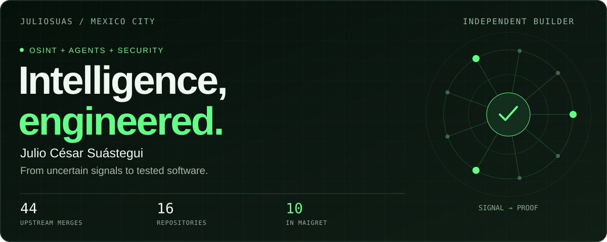
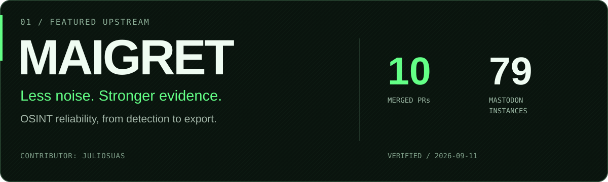

<p align="center">
  <picture>
    <source media="(max-width: 640px)" srcset="./assets/profile-dossier-mobile.svg">
    
  </picture>
</p>

<p align="center">
  <samp><a href="#maigret">01 / MAIGRET</a> &nbsp;·&nbsp; <a href="#selected-upstream">02 / UPSTREAM</a> &nbsp;·&nbsp; <a href="#contribution-ledger">03 / EVIDENCE</a> &nbsp;·&nbsp; <a href="#working-stack">04 / TOOLKIT</a></samp>
</p>

<br>

I’m **Julio**, an independent builder in **Mexico City** working across OSINT, agent systems, and security tooling. I turn ambiguous problems into software you can inspect: a focused change, a reproducible test, a public review.

**My most sustained upstream work is in [Maigret](https://github.com/soxoj/maigret)** — improving the path from a username search to evidence an investigator can use.

<br>

## Maigret

<a href="https://github.com/soxoj/maigret/pulls?q=is%3Apr+author%3Ajuliosuas+is%3Amerged">
  <picture>
    <source media="(max-width: 640px)" srcset="./assets/maigret-case-study-mobile.svg">
    
  </picture>
</a>

### From isolated fixes to a shared detection engine

A profile page returning `200 OK` is not enough evidence that an account exists. Anti-bot pages, rate limits, and stale absence messages can all look like a match. My Maigret contributions address that uncertainty across **detection, site onboarding, report compatibility, and test reliability**.

<table>
  <tr>
    <td width="50%" valign="top">
      <samp>01 / SHARED ENGINE</samp>
      <h3>79 instances. One lookup strategy.</h3>
      <p>Replaced per-site Mastodon probe copies with a shared engine using <code>accounts/lookup</code>. Moved 79 confirmed instances onto it and corrected the <code>mastodon.social</code> base URL.</p>
      <a href="https://github.com/soxoj/maigret/pull/3121"><strong>Inspect the engine → #3121</strong></a>
    </td>
    <td width="50%" valign="top">
      <samp>02 / SIGNAL QUALITY</samp>
      <h3>Stop reporting ghosts.</h3>
      <p>Fixed misleading checks in InterPals, ReverbNation, and Mastodon; disabled a forum probe whose rate-limit responses could turn arbitrary usernames into matches.</p>
      <a href="https://github.com/soxoj/maigret/pull/2442">#2442</a> &nbsp;·&nbsp; <a href="https://github.com/soxoj/maigret/pull/2588">#2588</a> &nbsp;·&nbsp; <a href="https://github.com/soxoj/maigret/pull/2929">#2929</a> &nbsp;·&nbsp; <a href="https://github.com/soxoj/maigret/pull/3111">#3111</a>
    </td>
  </tr>
  <tr>
    <td width="50%" valign="top">
      <samp>03 / REPORT INTEGRITY</samp>
      <h3>Protect the exported evidence.</h3>
      <p>Added the manifest expected by modern XMind readers while retaining the legacy XML format. Atomic archive rewriting preserves metadata and validates integrity before replacement.</p>
      <a href="https://github.com/soxoj/maigret/pull/2930"><strong>Inspect the export fix → #2930</strong></a>
    </td>
    <td width="50%" valign="top">
      <samp>04 / MAINTAINABILITY</samp>
      <h3>Teach the tool what to trust.</h3>
      <p>Preserved status-code evidence in site submission, expanded cybersecurity platform coverage, and adjusted executor timing tests for slower CI environments.</p>
      <a href="https://github.com/soxoj/maigret/pull/3024">#3024</a> &nbsp;·&nbsp; <a href="https://github.com/soxoj/maigret/pull/2318">#2318</a> &nbsp;·&nbsp; <a href="https://github.com/soxoj/maigret/pull/2558">#2558</a>
    </td>
  </tr>
</table>

<details>
<summary><strong>Read the engineering notes</strong> · decisions and verification behind the contributions</summary>

- **Mastodon engine · [#3121](https://github.com/soxoj/maigret/pull/3121):** confirmed hosts through instance metadata; inherited engine fields live inside the site configuration; tests cover inheritance and excluded lookalikes.
- **XMind archives · [#2930](https://github.com/soxoj/maigret/pull/2930):** regression coverage includes manifest completeness, ZIP integrity, Unicode, idempotence, metadata preservation, and failure cleanup. The PR reports seven focused tests passing; desktop-reader verification remained a reviewer check.
- **Site submission · [#3024](https://github.com/soxoj/maigret/pull/3024):** a claimed 2xx response and unclaimed non-2xx response create a status-code check; message matching remains the fallback.
- **CI timing · [#2558](https://github.com/soxoj/maigret/pull/2558):** relaxed upper bounds while retaining lower bounds that check concurrent execution.
- **Documentation · [#2779](https://github.com/soxoj/maigret/pull/2779):** scoped spelling cleanup, included in the ten merged PRs.

</details>

<p>
  <a href="https://github.com/soxoj/maigret/pulls?q=is%3Apr+author%3Ajuliosuas+is%3Amerged"></a>
  <a href="https://github.com/soxoj/maigret/pulls?q=is%3Apr+author%3Ajuliosuas+is%3Aopen"></a>
</p>

<br>

## Selected upstream

**The same engineering habits, across different systems.** A selection from **44 verified merges in 16 upstream repositories**, including the ten Maigret contributions above.

<table>
  <tr>
    <td width="50%" valign="top">
      <a href="https://github.com/palantir/blueprint/pull/8165"></a>
      <h3>Palantir / Blueprint</h3>
      <strong>Catch what aliases hide.</strong>
      <p>Deprecated React components stay visible to ESLint, even under a different import name.</p>
      <sub>TypeScript · static analysis</sub><br><br>
      <a href="https://github.com/palantir/blueprint/pull/8165"><strong>View merged contribution ↗</strong></a>
    </td>
    <td width="50%" valign="top">
      <a href="https://github.com/getsentry/sentry-python/pull/6241"></a>
      <h3>Sentry / Python SDK</h3>
      <strong>Privacy with a precise switch.</strong>
      <p>An opt-in scrubber control removes user IP addresses while preserving default behavior.</p>
      <sub>Python · SDK design</sub><br><br>
      <a href="https://github.com/getsentry/sentry-python/pull/6241"><strong>View merged contribution ↗</strong></a>
    </td>
  </tr>
  <tr>
    <td width="50%" valign="top">
      <a href="https://github.com/OWASP/Agent-Security-Regression-Harness/pull/149"></a>
      <h3>OWASP / Agent Harness</h3>
      <strong>Test the authenticated path.</strong>
      <p>Live HTTP headers enable authenticated agent testing without entering result artifacts.</p>
      <sub>Python · agent security</sub><br><br>
      <a href="https://github.com/OWASP/Agent-Security-Regression-Harness/pull/149"><strong>View merged contribution ↗</strong></a>
    </td>
    <td width="50%" valign="top">
      <a href="https://github.com/mitmproxy/mitmproxy/pull/8405"></a>
      <h3>mitmproxy</h3>
      <strong>Make edge cases uneventful.</strong>
      <p>Windows line-ending normalization, plus a separate fix for short binary payload crashes.</p>
      <sub>Python · traffic inspection</sub><br><br>
      <a href="https://github.com/mitmproxy/mitmproxy/pull/8405"><strong>View merged contribution ↗</strong></a>
    </td>
  </tr>
  <tr>
    <td width="50%" valign="top">
      <a href="https://github.com/google-labs-code/design.md/pull/131"></a>
      <h3>Google Labs / design.md</h3>
      <strong>Keep the spec in charge.</strong>
      <p>Primitive types render from configuration, keeping generated specs aligned with source data.</p>
      <sub>TypeScript · design tools</sub><br><br>
      <a href="https://github.com/google-labs-code/design.md/pull/131"><strong>View merged contribution ↗</strong></a>
    </td>
    <td width="50%" valign="top">
      <a href="https://github.com/kellyjonbrazil/jc/pull/722"></a>
      <h3>jc / CLI data tooling</h3>
      <strong>Preserve what the input says.</strong>
      <p>Empty and bracketed scalars survive parsing, alongside netmask and packaging fixes.</p>
      <sub>Python · parsers</sub><br><br>
      <a href="https://github.com/kellyjonbrazil/jc/pull/722"><strong>View merged contribution ↗</strong></a>
    </td>
  </tr>
</table>

<details>
<summary><strong>Security fieldwork, infrastructure &amp; developer experience</strong></summary>

- **[Cybersecurity Skills](https://github.com/mukul975/Anthropic-Cybersecurity-Skills/pulls?q=is%3Apr+author%3Ajuliosuas+is%3Amerged)** — eight merged contributions covering OSINT correlation, metadata validation, MITRE ATT&amp;CK and NIST mappings, AWS Detective, Zeek workflows, forensics examples, and Spanish translations. Independent community project.
- **[Texas Instruments](https://github.com/TexasInstruments/open-pru/pull/139)** — portable assembly include-path guidance, plus Android documentation formatting and spelling fixes.
- **[Locust](https://github.com/locustio/locust/pull/3384)** — corrected aggregate request-rate reporting.
- **[Glances](https://github.com/nicolargo/glances/pull/3505)** — bounded memory calculations for LXC containers.
- **Aqua Security / Trivy** and **Zeek** — documentation corrections, linked in the complete ledger.

</details>

<br>

## Contribution ledger

<details>
<summary><strong>Open all 44 receipts</strong> · code, tests, documentation, and translations across 16 repositories</summary>
<br>

The original PR titles make each change's scope visible. Counts describe the linked snapshot; current activity is available in the <a href="https://github.com/pulls?q=is%3Apr+author%3Ajuliosuas+is%3Amerged+-user%3Ajuliosuas">live merged-PR search</a>.

<table>
  <tr><th align="left">Upstream</th><th align="left">Merged contributions</th></tr>
  <tr>
    <td><a href="https://github.com/soxoj/maigret"><strong>soxoj/maigret</strong></a><br><sub>10 merged</sub></td>
    <td><a href="https://github.com/soxoj/maigret/pull/2318"><code>#2318</code></a> feat: add cybersecurity platforms + re-enable Root-Me<br>
      <a href="https://github.com/soxoj/maigret/pull/2442"><code>#2442</code></a> fix(data): update InterPals absence string to match current site response<br>
      <a href="https://github.com/soxoj/maigret/pull/2558"><code>#2558</code></a> test: loosen executor timing upper bounds for slower CI<br>
      <a href="https://github.com/soxoj/maigret/pull/2588"><code>#2588</code></a> fix: disable RomanticCollection check<br>
      <a href="https://github.com/soxoj/maigret/pull/2779"><code>#2779</code></a> docs: fix typos<br>
      <a href="https://github.com/soxoj/maigret/pull/2929"><code>#2929</code></a> Fix ReverbNation false-positive check<br>
      <a href="https://github.com/soxoj/maigret/pull/2930"><code>#2930</code></a> Fix XMind reports for modern readers<br>
      <a href="https://github.com/soxoj/maigret/pull/3024"><code>#3024</code></a> Detect status-code checks in --submit fallback<br>
      <a href="https://github.com/soxoj/maigret/pull/3111"><code>#3111</code></a> Fix social.tchncs.de false-positive check<br>
      <a href="https://github.com/soxoj/maigret/pull/3121"><code>#3121</code></a> Add shared Mastodon engine with accounts/lookup urlProbe</td>
  </tr>
  <tr>
    <td><a href="https://github.com/mitmproxy/mitmproxy"><strong>mitmproxy/mitmproxy</strong></a><br><sub>3 merged</sub></td>
    <td><a href="https://github.com/mitmproxy/mitmproxy/pull/8196"><code>#8196</code></a> fix: avoid IndexError in is_mostly_bin for short tails<br>
      <a href="https://github.com/mitmproxy/mitmproxy/pull/8285"><code>#8285</code></a> docs: fix typos<br>
      <a href="https://github.com/mitmproxy/mitmproxy/pull/8405"><code>#8405</code></a> fix: normalize CRLF in CSS and XML/HTML prettifiers</td>
  </tr>
  <tr>
    <td><a href="https://github.com/kellyjonbrazil/jc"><strong>kellyjonbrazil/jc</strong></a><br><sub>4 merged</sub></td>
    <td><a href="https://github.com/kellyjonbrazil/jc/pull/692"><code>#692</code></a> fix: use [2:] instead of lstrip('0x') to strip hex prefix in ifconfig parser<br>
      <a href="https://github.com/kellyjonbrazil/jc/pull/711"><code>#711</code></a> docs: fix typos<br>
      <a href="https://github.com/kellyjonbrazil/jc/pull/722"><code>#722</code></a> Preserve bracketed and empty scalar values<br>
      <a href="https://github.com/kellyjonbrazil/jc/pull/741"><code>#741</code></a> test: find setup.py when tests are copied into a build tree</td>
  </tr>
  <tr>
    <td><a href="https://github.com/getsentry/responses"><strong>getsentry/responses</strong></a><br><sub>3 merged</sub></td>
    <td><a href="https://github.com/getsentry/responses/pull/791"><code>#791</code></a> fix: remove content-type from headers in _add_from_file to avoid RuntimeError<br>
      <a href="https://github.com/getsentry/responses/pull/800"><code>#800</code></a> docs: fix typos<br>
      <a href="https://github.com/getsentry/responses/pull/807"><code>#807</code></a> fix: type CallList as a sequence of calls</td>
  </tr>
  <tr>
    <td><a href="https://github.com/google-labs-code/design.md"><strong>google-labs-code/design.md</strong></a><br><sub>1 merged</sub></td>
    <td><a href="https://github.com/google-labs-code/design.md/pull/131"><code>#131</code></a> fix: render primitive types from spec config</td>
  </tr>
  <tr>
    <td><a href="https://github.com/palantir/blueprint"><strong>palantir/blueprint</strong></a><br><sub>1 merged</sub></td>
    <td><a href="https://github.com/palantir/blueprint/pull/8165"><code>#8165</code></a> [eslint-plugin] Detect deprecated components imported with aliases</td>
  </tr>
  <tr>
    <td><a href="https://github.com/racecraft-lab/Paddock"><strong>racecraft-lab/Paddock</strong></a><br><sub>1 merged</sub></td>
    <td><a href="https://github.com/racecraft-lab/Paddock/pull/86"><code>#86</code></a> Enhance Office activity visuals</td>
  </tr>
  <tr>
    <td><a href="https://github.com/TexasInstruments/processor-sdk-doc"><strong>TexasInstruments/processor-sdk-doc</strong></a><br><sub>1 merged</sub></td>
    <td><a href="https://github.com/TexasInstruments/processor-sdk-doc/pull/720"><code>#720</code></a> style: normalize Android RST indentation</td>
  </tr>
  <tr>
    <td><a href="https://github.com/zeek/package-manager"><strong>zeek/package-manager</strong></a><br><sub>2 merged</sub></td>
    <td><a href="https://github.com/zeek/package-manager/pull/222"><code>#222</code></a> Fix quickstart grammar typo<br>
      <a href="https://github.com/zeek/package-manager/pull/224"><code>#224</code></a> docs: fix typos</td>
  </tr>
  <tr>
    <td><a href="https://github.com/TexasInstruments/open-pru"><strong>TexasInstruments/open-pru</strong></a><br><sub>2 merged</sub></td>
    <td><a href="https://github.com/TexasInstruments/open-pru/pull/139"><code>#139</code></a> docs: add portable assembly include path guidance<br>
      <a href="https://github.com/TexasInstruments/open-pru/pull/146"><code>#146</code></a> docs: fix typos</td>
  </tr>
  <tr>
    <td><a href="https://github.com/OWASP/Agent-Security-Regression-Harness"><strong>OWASP/Agent-Security-Regression-Harness</strong></a><br><sub>1 merged</sub></td>
    <td><a href="https://github.com/OWASP/Agent-Security-Regression-Harness/pull/149"><code>#149</code></a> feat: support live HTTP target headers</td>
  </tr>
  <tr>
    <td><a href="https://github.com/getsentry/sentry-python"><strong>getsentry/sentry-python</strong></a><br><sub>2 merged</sub></td>
    <td><a href="https://github.com/getsentry/sentry-python/pull/6241"><code>#6241</code></a> Add option to drop scrubbed user IP addresses<br>
      <a href="https://github.com/getsentry/sentry-python/pull/6602"><code>#6602</code></a> docs: fix typos</td>
  </tr>
  <tr>
    <td><a href="https://github.com/aquasecurity/trivy"><strong>aquasecurity/trivy</strong></a><br><sub>2 merged</sub></td>
    <td><a href="https://github.com/aquasecurity/trivy/pull/10828"><code>#10828</code></a> docs: fix repository scan heading typo<br>
      <a href="https://github.com/aquasecurity/trivy/pull/10857"><code>#10857</code></a> docs: fix typos</td>
  </tr>
  <tr>
    <td><a href="https://github.com/locustio/locust"><strong>locustio/locust</strong></a><br><sub>2 merged</sub></td>
    <td><a href="https://github.com/locustio/locust/pull/3384"><code>#3384</code></a> fix: use total_rps instead of current_rps in HTML report and navbar stats<br>
      <a href="https://github.com/locustio/locust/pull/3426"><code>#3426</code></a> docs: fix typos</td>
  </tr>
  <tr>
    <td><a href="https://github.com/mukul975/Anthropic-Cybersecurity-Skills"><strong>mukul975/Anthropic-Cybersecurity-Skills</strong></a><br><sub>8 merged</sub></td>
    <td><a href="https://github.com/mukul975/Anthropic-Cybersecurity-Skills/pull/11"><code>#11</code></a> Add skill: performing-ai-driven-osint-correlation<br>
      <a href="https://github.com/mukul975/Anthropic-Cybersecurity-Skills/pull/12"><code>#12</code></a> Add NIST CSF 2.0 categories to compliance-governance skills<br>
      <a href="https://github.com/mukul975/Anthropic-Cybersecurity-Skills/pull/15"><code>#15</code></a> Add working example output to digital-forensics skills (fixes #4)<br>
      <a href="https://github.com/mukul975/Anthropic-Cybersecurity-Skills/pull/22"><code>#22</code></a> Translate top skills to Spanish for international reach<br>
      <a href="https://github.com/mukul975/Anthropic-Cybersecurity-Skills/pull/26"><code>#26</code></a> Add MITRE ATT&amp;CK IDs to incident response skills (fixes #1)<br>
      <a href="https://github.com/mukul975/Anthropic-Cybersecurity-Skills/pull/27"><code>#27</code></a> Add skill: performing-cloud-native-threat-hunting-with-aws-detective<br>
      <a href="https://github.com/mukul975/Anthropic-Cybersecurity-Skills/pull/28"><code>#28</code></a> Add bulk skill metadata validation script<br>
      <a href="https://github.com/mukul975/Anthropic-Cybersecurity-Skills/pull/29"><code>#29</code></a> Add skill: detecting-lateral-movement-with-zeek (fixes #5)</td>
  </tr>
  <tr>
    <td><a href="https://github.com/nicolargo/glances"><strong>nicolargo/glances</strong></a><br><sub>1 merged</sub></td>
    <td><a href="https://github.com/nicolargo/glances/pull/3505"><code>#3505</code></a> fix: clamp memory used/percent to non-negative values for LXC containers</td>
  </tr>
</table>
</details>

<details>
<summary><strong>Field notes</strong> · what connects the work</summary>

- **Evidence quality** — distinguish missing profiles from redirects, rate limits, and pages that return HTTP 200 for everyone.
- **Boundary behavior** — test short payloads, empty scalars, aliased imports, Windows line endings, and container memory accounting.
- **Useful security tooling** — make authenticated agent tests, privacy controls, investigation workflows, and metadata validation practical.
- **Maintenance is part of delivery** — portable assembly guidance, corrected documentation, packaging tests, and Spanish translations belong in the record too.

The Anthropic-Cybersecurity-Skills repository is an **independent community project**, not an official Anthropic project. Its eight merged contributions are listed above; closed, unmerged proposals are excluded from the count.

</details>


<br>

## On the workbench

Selected proposals **open as of 2026-09-11**. Follow each PR for its current review status.

| Project | Proposed change | Status |
| --- | --- | --- |
| [Nmap #3458](https://github.com/nmap/nmap/pull/3458) | Clarify the IPv6 protocol-family context in packet-trace output. | Open |
| [PyPA · Hatch #2405](https://github.com/pypa/hatch/pull/2405) | Support free-threaded Python aliases such as `3.13t` and `3.14t`. | Open |
| [Cloudflare · moq-rs #219](https://github.com/cloudflare/moq-rs/pull/219) | Clarify support for MoQ draft branches. | Open |

[Explore the current upstream workbench →](https://github.com/pulls?q=is%3Apr+author%3Ajuliosuas+is%3Aopen+-user%3Ajuliosuas)


<br>

## Working stack

<p>
  
  
  
  
  
  
  
  
</p>


<details>
<summary><strong>Operating system</strong> · how I turn a problem into a contribution</summary>

```text
REPRODUCE   → capture the failure
ISOLATE     → narrow the cause
PATCH       → change the smallest useful surface
VERIFY      → test the behavior and its boundaries
REVIEW      → make the reasoning inspectable
SHIP        → link the accepted result
```

I use agents with explicit ownership for implementation, infrastructure, and QA. The output I care about is reviewable software with evidence attached.

</details>

<details>
<summary><strong>Open the original operator terminal</strong></summary>

<p align="center">
  
</p>

</details>

<br>

<p align="center">
  <samp>BUILT IN MEXICO CITY · VERIFIED IN PUBLIC</samp><br><br>
  <strong>Build the system. Test the claim. Ship the evidence.</strong><br><br>
  <a href="https://github.com/juliosuas/ghost">ghost</a> &nbsp; / &nbsp;
  <a href="https://github.com/juliosuas?tab=repositories">projects</a> &nbsp; / &nbsp;
  <a href="https://github.com/pulls?q=is%3Apr+author%3Ajuliosuas">all pull requests</a>
</p>

<p align="center"><sub>Contribution snapshot verified 2026-09-11. Counts exclude repositories under my own account; PR links show current status.</sub></p>
