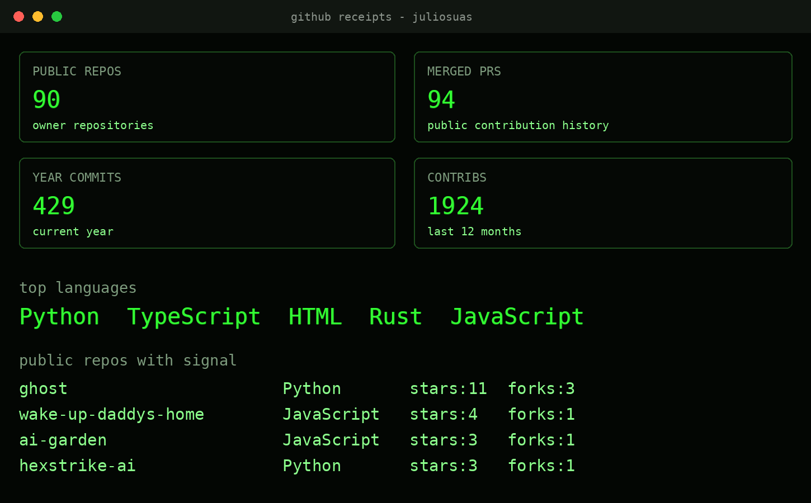

  

  
  
  

I build **agentic engineering systems, security tooling, and product operations** that turn ambiguous work into tested, reviewable software. My current obsession is making autonomous development accountable: narrow diffs, reproducible evidence, hard QA gates, and useful products at the end.

Based in Mexico City. Working in public across AI agents, developer tooling, OSINT, cybersecurity, and automation.

### Selected systems

| Project | What it proves |
| --- | --- |
| [**Ghost**](https://github.com/juliosuas/ghost) | AI-powered OSINT investigations across 70+ username sources, evidence capture, analysis, and professional reporting. |
| [**AI Garden**](https://github.com/juliosuas/ai-garden) | A living pixel-art world evolved through public contributions from autonomous AI agents. [Enter the garden →](https://juliosuas.github.io/ai-garden/) |
| [**Copyfail Guard**](https://github.com/juliosuas/copyfail-guard) | Auditable Linux mitigation and verification tooling for a real kernel security failure mode. |
| [**Polymarket Desk**](https://github.com/juliosuas/polymarket-desk) | A read-only market intelligence desk for flow, movers, value screens, and live tape. [Open the desk →](https://polymarket-desk-seven.vercel.app) |
| [**Wake Up Daddy's Home**](https://github.com/juliosuas/wake-up-daddys-home) | A physical-computing JARVIS ritual: clap activation, dashboard orchestration, and Spotify. |

### Open-source receipts

Not contribution wallpaper—merged changes in projects people depend on:

- [**Sentry Python #6241**](https://github.com/getsentry/sentry-python/pull/6241) — added an option to drop scrubbed user IP addresses.
- [**Palantir Blueprint #8165**](https://github.com/palantir/blueprint/pull/8165) — detected deprecated React components imported through aliases.
- [**OWASP Agent Security Regression Harness #149**](https://github.com/OWASP/Agent-Security-Regression-Harness/pull/149) — added live HTTP target header support.
- [**Locust #3384**](https://github.com/locustio/locust/pull/3384) — corrected report and navbar request-rate semantics.
- [**Aqua Trivy #10828**](https://github.com/aquasecurity/trivy/pull/10828) · [**#10857**](https://github.com/aquasecurity/trivy/pull/10857) — documentation corrections in a widely used security scanner.
- [**Texas Instruments open-pru #139**](https://github.com/TexasInstruments/open-pru/pull/139) · [**processor-sdk-doc #720**](https://github.com/TexasInstruments/processor-sdk-doc/pull/720) — portable toolchain guidance and documentation quality.
- **Maigret repeat contributor** — merged fixes and features across [#2318](https://github.com/soxoj/maigret/pull/2318), [#2442](https://github.com/soxoj/maigret/pull/2442), [#2558](https://github.com/soxoj/maigret/pull/2558), [#2588](https://github.com/soxoj/maigret/pull/2588), and [#2779](https://github.com/soxoj/maigret/pull/2779).

  

### Shipping now

- [Maigret #2930](https://github.com/soxoj/maigret/pull/2930) — modern XMind reader compatibility; full multi-version CI green.
- [Maigret #2929](https://github.com/soxoj/maigret/pull/2929) — ReverbNation false-positive detection; full multi-version CI green.
- [jc #722](https://github.com/kellyjonbrazil/jc/pull/722) — preserves bracketed and empty scalar values; 20-platform CI matrix green.

### Working stack

  
  
  
  
  
  
  
  

<strong>How I ship with agents</strong>

I run a multi-agent engineering loop with explicit ownership:

1. **Jeffrey** orchestrates scope, implementation, and delivery.
2. **Magno** handles infrastructure and heavy build/test workloads.
3. **Ludwig** is the senior engineering and QA gate.
4. Every non-trivial claim closes with evidence: tests, CI, review state, and a precise remaining risk.

The goal is not “AI wrote code.” The goal is reliable software with a shorter path from intent to proof.

<strong>Open the operator terminal</strong>

  

  

  <strong>Build the system. Test the claim. Ship the evidence.</strong> 
  <a href="https://github.com/juliosuas/ghost">flagship project</a> · <a href="https://github.com/juliosuas?tab=repositories">repositories</a> · <a href="https://github.com/pulls?q=is%3Apr+author%3Ajuliosuas">pull requests</a>

